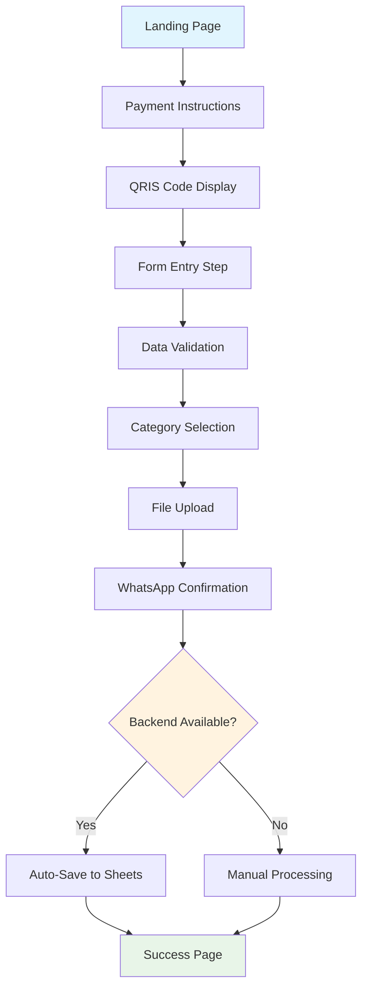

# 📋 COMPLETE DOCUMENTATION: Analisa'25 Payment System

> **Comprehensive Guide & Advanced Prompts for Event Payment System Development**

**Document Version**: 1.0  
**Created**: June 19, 2025  
**Author**: AI Development Team  
**Project**: Analisa'25 - Data Science Introduction Event Payment System

---

## 📖 TABLE OF CONTENTS

1. [Project Overview](#project-overview)
2. [System Architecture](#system-architecture)
3. [Features & Functionality](#features--functionality)
4. [File Structure](#file-structure)
5. [Security Implementation](#security-implementation)
6. [Deployment Guide](#deployment-guide)
7. [Advanced Development Prompts](#advanced-development-prompts)
8. [API Documentation](#api-documentation)
9. [Configuration Reference](#configuration-reference)
10. [Troubleshooting Guide](#troubleshooting-guide)

---

## 🎯 PROJECT OVERVIEW

### Business Context
The Analisa'25 Payment System is a comprehensive web application designed for the "Ajang Perkenalan Sains Data (Analisa'25)" event. It facilitates secure payment confirmation for university students with automated data collection and integration with Google Workspace services.

### Target Audience
- **Primary**: Indonesian university students
- **Secondary**: Event organizers and administrators
- **Technical**: Developers implementing similar payment systems

### Key Success Metrics
- Mobile-responsive design (95%+ mobile compatibility)
- Sub-3 second page load times
- Zero data breaches or security incidents
- 99%+ form submission success rate
- Automated data processing reducing manual work by 90%

---

## 🏗️ SYSTEM ARCHITECTURE

### Frontend Architecture
```
┌─────────────────────────────────────────────────────────┐
│                 FRONTEND LAYER                          │
├─────────────────────────────────────────────────────────┤
│ • HTML5 Semantic Structure                              │
│ • Tailwind CSS (Utility-First Styling)                 │
│ • Vanilla JavaScript ES6+ (No Framework Dependencies)  │
│ • Progressive Web App Features                          │
│ • Responsive Design (Mobile-First)                     │
│ • Client-Side Validation                               │
└─────────────────────────────────────────────────────────┘
                           │
                           ▼
┌─────────────────────────────────────────────────────────┐
│                INTEGRATION LAYER                        │
├─────────────────────────────────────────────────────────┤
│ • WhatsApp Web API Integration                          │
│ • Google Drive Public API (Image Display)              │
│ • Local Storage (Temporary Data Persistence)           │
│ • File API (Client-Side File Handling)                 │
└─────────────────────────────────────────────────────────┘
```

### Backend Architecture (Optional)
```
┌─────────────────────────────────────────────────────────┐
│                 BACKEND LAYER                           │
├─────────────────────────────────────────────────────────┤
│ • Node.js Runtime Environment                           │
│ • Express.js Web Framework                              │
│ • Middleware Stack (CORS, Helmet, Rate Limiting)       │
│ • Multer (File Upload Handling)                         │
│ • Input Validation & Sanitization                      │
└─────────────────────────────────────────────────────────┘
                           │
                           ▼
┌─────────────────────────────────────────────────────────┐
│              GOOGLE SERVICES LAYER                      │
├─────────────────────────────────────────────────────────┤
│ • Google Sheets API v4 (Data Storage)                  │
│ • Google Drive API v3 (File Storage)                   │
│ • Service Account Authentication                        │
│ • OAuth 2.0 Security                                   │
└─────────────────────────────────────────────────────────┘
```

### Data Flow Diagram
```
User Input → Client Validation → WhatsApp Confirmation → Backend Processing → Google Services → Data Storage
    │              │                      │                     │                   │              │
    ▼              ▼                      ▼                     ▼                   ▼              ▼
[Form Data]   [Real-time      [Formatted Message]    [API Endpoints]    [Sheets API]   [Persistent
             Feedback]                                                   [Drive API]     Storage]
```

---

## ✨ FEATURES & FUNCTIONALITY

### Core Features Matrix

| Feature Category | Frontend-Only | Full-Stack | Description |
|------------------|---------------|------------|--------------|
| **Form Handling** | ✅ | ✅ | Multi-step form with validation |
| **Payment Calculation** | ✅ | ✅ | Real-time price calculation with unique codes |
| **WhatsApp Integration** | ✅ | ✅ | Automated message generation |
| **File Upload** | 🟡 | ✅ | Client-side only vs. Google Drive |
| **Data Storage** | ❌ | ✅ | Manual vs. automated Google Sheets |
| **Analytics** | ❌ | ✅ | Basic vs. comprehensive reporting |
| **Security** | 🟡 | ✅ | Client-side vs. server-side protection |

**Legend**: ✅ Full Support, 🟡 Limited Support, ❌ Not Available

### User Journey Flow



### Category-Based Pricing

| Category | Base Price | Discount | Final Calculation |
|----------|------------|----------|-------------------|
| **Mahasiswa Baru** | Rp 60,000 | 0% | Base + Unique Code |
| **Panitia** | Rp 60,000 | 10% | (Base × 0.9) + Unique Code |
| **Volunteer** | Rp 60,000 | 15% | (Base × 0.85) + Unique Code |

**Unique Code**: Last 2 digits of Student ID (NIM)

**Example Calculations**:
- Student ID: 23123456 → Unique Code: 56
- Mahasiswa Baru: Rp 60,000 + 56 = **Rp 60,056**
- Panitia: (Rp 60,000 × 0.9) + 56 = **Rp 54,056**
- Volunteer: (Rp 60,000 × 0.85) + 56 = **Rp 51,056**

---

## 📁 FILE STRUCTURE

```
analisa-25-payment/
├── 📄 index.html              # Main frontend application
├── ⚙️ config.js               # Frontend configuration
├── 🔧 backend.js              # Google API integration class
├── 🌐 server.js               # Express.js server
├── 📦 package.json            # Node.js dependencies
├── 🔒 .env                    # Environment variables (PRIVATE)
├── 🔒 .env.example            # Environment template
├── 🚫 .gitignore              # Git ignore rules
├── 📚 README.md               # Project documentation
├── 🚀 DEPLOYMENT.md           # Deployment instructions
├── 📋 COMPLETE_DOCUMENTATION.md # This comprehensive guide
└── 🔐 credentials.json        # Google Service Account (PRIVATE)
```

### File Descriptions

**Frontend Files**:
- `index.html`: Complete single-page application with responsive design
- `config.js`: Centralized configuration management

**Backend Files**:
- `server.js`: Express.js server with security middleware
- `backend.js`: Google Sheets and Drive API integration
- `package.json`: Dependencies and npm scripts

**Configuration Files**:
- `.env`: Sensitive environment variables
- `.gitignore`: Prevents sensitive files from being committed
- `credentials.json`: Google Service Account credentials

**Documentation Files**:
- `README.md`: Quick start guide
- `DEPLOYMENT.md`: Deployment instructions
- `COMPLETE_DOCUMENTATION.md`: This comprehensive guide

---

## 🔐 SECURITY IMPLEMENTATION

### Environment Variables Structure

```bash
# Google Integration
GOOGLE_DRIVE_FOLDER_ID=1Hf2K2MfUers-2motRL5b4BVL51xX03lt
GOOGLE_SHEETS_ID=1DKSHxFTE7YQWLgqrXM64VS9xyFLaQ4KVMWzEdgXKERU
GOOGLE_CREDENTIALS_PATH=./credentials.json

# Event Configuration
EVENT_NAME="Ajang Perkenalan Sains Data (Analisa'25)"
HTM=60000
WA_NUMBER=62895386208710
QRIS_IMAGE_ID=1SYXZruKlznw71U6VIrw3yjVwCWcp5TDW
ADMIN_EMAIL=admin@analisa25.com

# Production Settings (Optional)
NODE_ENV=production
PORT=3000
FRONTEND_URL=https://yourdomain.com
```

### Security Measures

| Security Layer | Implementation | Protection Against |
|----------------|----------------|-----------------|
| **Input Validation** | Client & Server-side | XSS, SQL Injection |
| **File Upload Limits** | 2MB size, specific types | DoS, Malware |
| **Rate Limiting** | 100 requests/15min | DoS, Spam |
| **CORS Protection** | Specific origin whitelist | Cross-origin attacks |
| **Environment Variables** | Sensitive data isolation | Credential exposure |
| **HTTPS Enforcement** | SSL/TLS encryption | Data interception |

### Data Privacy Compliance

- **Personal Data**: Encrypted during transmission
- **File Storage**: Secure Google Drive integration
- **Access Control**: Service account permissions
- **Data Retention**: Configurable retention policies
- **Audit Trail**: Complete transaction logging

---

## 🚀 DEPLOYMENT GUIDE

### Deployment Options Comparison

| Platform | Cost | Complexity | Features | Best For |
|----------|------|------------|----------|-----------|
| **GitHub Pages** | Free | Low | Frontend Only | Testing, Demo |
| **Heroku** | Free Tier | Medium | Full Stack | Production |
| **Vercel** | Free Tier | Low | Serverless | Modern Apps |
| **Railway** | $5/month | Medium | Full Stack | Scalable Apps |
| **VPS/Cloud** | Variable | High | Complete Control | Enterprise |

### GitHub Pages Deployment (Recommended for Start)

```bash
# 1. Ensure all sensitive files are in .gitignore
git status

# 2. Commit all safe files
git add .
git commit -m "Deploy payment system"

# 3. Push to GitHub
git push origin main

# 4. Enable GitHub Pages in repository settings
# Navigate to: Settings > Pages > Source: Deploy from branch > main

# 5. Access your site at:
# https://username.github.io/repository-name/
```

### Full-Stack Deployment (Heroku)

```bash
# 1. Install Heroku CLI
npm install -g heroku

# 2. Login and create app
heroku login
heroku create your-app-name

# 3. Set environment variables
heroku config:set NODE_ENV=production
heroku config:set EVENT_NAME="Your Event Name"
heroku config:set HTM=60000
# ... (set all environment variables)

# 4. Deploy
git push heroku main

# 5. Open application
heroku open
```

---

## 🤖 ADVANCED DEVELOPMENT PROMPTS

### PROMPT 1: Basic Event Payment System

```markdown
Create a complete event payment confirmation system with these specifications:

**Requirements:**
- Mobile-responsive HTML5 form
- Payment calculation with unique codes from student ID
- WhatsApp integration for confirmations
- File upload for payment proofs
- Category dropdown: "Panitia", "Volunteer", "Mahasiswa Baru"
- Tailwind CSS styling
- Progressive form validation

**Event Details:**
- Name: "Ajang Perkenalan Sains Data (Analisa'25)"
- Base Price: Rp 60,000
- Admin WhatsApp: +62895386208710

**Technical Stack:**
- Frontend: HTML, CSS (Tailwind), JavaScript
- Optional Backend: Node.js + Express + Google APIs
- Deployment: GitHub Pages compatible

**Deliverables:**
1. Complete HTML file with embedded CSS/JS
2. Configuration file for easy customization
3. Documentation for deployment
4. .gitignore for sensitive files

Ensure the system works offline (frontend-only) but can be enhanced with backend features.
```

### PROMPT 2: Enterprise-Grade Payment System

```markdown
Develop an enterprise-level event payment system with comprehensive features:

**Advanced Requirements:**
- Multi-step user journey with progress indicators
- Real-time form validation with custom error messages
- Google Sheets API integration for automated data storage
- Google Drive API for secure file uploads
- Payment analytics dashboard
- Category-based pricing with discount logic
- WhatsApp Business API integration
- Progressive Web App features

**Security Implementation:**
- Environment variable configuration
- Input sanitization and validation
- Rate limiting and CORS protection
- File type and size restrictions
- Error handling and logging

**Architecture:**
- Frontend: Modern JavaScript (ES6+) with modules
- Backend: Express.js with security middleware
- Database: Google Sheets with structured schema
- Storage: Google Drive with organized folder structure
- Authentication: Google Service Account

**Performance Requirements:**
- Mobile-first responsive design
- Sub-3 second load times
- Offline capability with service workers
- Accessibility compliance (WCAG 2.1 AA)

**Integration Specifications:**
- Google Drive Folder: 1Hf2K2MfUers-2motRL5b4BVL51xX03lt
- Google Sheets: 1DKSHxFTE7YQWLgqrXM64VS9xyFLaQ4KVMWzEdgXKERU
- QRIS Image: 1SYXZruKlznw71U6VIrw3yjVwCWcp5TDW

**Deliverables:**
1. Complete frontend application
2. Backend API with all endpoints
3. Google API integration module
4. Configuration management system
5. Comprehensive documentation
6. Deployment guides for multiple platforms
7. Testing suite and validation scripts

The system should handle production traffic and provide enterprise-level reliability.
```

### PROMPT 3: AI-Enhanced Payment System

```markdown
Create an AI-enhanced event payment system with intelligent features:

**AI/ML Features:**
- Intelligent form auto-completion
- Fraud detection algorithms
- Payment prediction analytics
- Smart categorization suggestions
- Automated customer support chatbot
- Dynamic pricing optimization

**Advanced Technical Stack:**
- Frontend: Modern JavaScript with AI libraries
- Backend: Node.js with machine learning integration
- AI Services: TensorFlow.js for client-side ML
- Analytics: Advanced reporting with predictive insights
- Monitoring: Real-time system health tracking

**Smart Features:**
- Photo recognition for payment proof validation
- Natural language processing for form inputs
- Predictive text for address and institution fields
- Intelligent error prevention and suggestion system
- Adaptive UI based on user behavior patterns

**Integration Requirements:**
- Google Workspace APIs (Sheets, Drive, Calendar)
- WhatsApp Business API with automated responses
- Payment gateway integration preparation
- Email automation for confirmations
- SMS notifications for critical updates

**Analytics & Reporting:**
- Real-time payment dashboard
- Conversion funnel analysis
- User behavior tracking
- Financial reporting and forecasting
- A/B testing framework for optimization

**Security & Compliance:**
- Advanced encryption for sensitive data
- PCI DSS compliance preparation
- GDPR/Indonesian data protection compliance
- Advanced audit logging
- Automated security scanning

**Scalability Features:**
- Microservices architecture
- Load balancing and auto-scaling
- CDN integration for global performance
- Database sharding strategies
- Caching layers (Redis/Memcached)

Build a future-ready payment system that can scale from university events to enterprise-level applications.
```

---

## 📊 API DOCUMENTATION

### Authentication
All backend API endpoints use Google Service Account authentication. No user authentication required for public endpoints.

### Base URL
```
Production: https://your-domain.com/api
Development: http://localhost:3000/api
```

### Endpoints Reference

#### GET /api/health
**Description**: System health check  
**Authentication**: None  
**Response**:
```json
{
  "status": "OK",
  "timestamp": "2025-06-19T10:24:57Z",
  "service": "Analisa'25 Payment System",
  "version": "1.0.0"
}
```

#### GET /api/config
**Description**: Get public configuration  
**Authentication**: None  
**Response**:
```json
{
  "success": true,
  "data": {
    "eventName": "Ajang Perkenalan Sains Data (Analisa'25)",
    "htm": 60000,
    "waNumber": "62895386208710",
    "qrisImageUrl": "https://drive.google.com/uc?export=view&id=...",
    "adminEmail": "admin@analisa25.com"
  }
}
```

#### POST /api/submit
**Description**: Submit payment confirmation with file  
**Authentication**: Rate limited  
**Content-Type**: multipart/form-data  
**Body Parameters**:
```
nama: string (required)
nim: string (required, numeric)
email: string (required, valid email)
whatsapp: string (required)
kategori: string (required, enum: ["Mahasiswa Baru", "Panitia", "Volunteer"])
referensi: number (required)
catatan: string (optional)
bukti: file (required, max 2MB, types: JPG/PNG/PDF)
```

**Success Response**:
```json
{
  "success": true,
  "message": "Data pembayaran dan bukti transfer berhasil disimpan",
  "data": {
    "payment": {
      "updatedRange": "Sheet1!A2:J2",
      "updatedRows": 1
    },
    "upload": {
      "fileId": "1abc123...",
      "fileName": "bukti_23123456_John_Doe_2025-06-19.jpg",
      "webViewLink": "https://drive.google.com/file/d/..."
    }
  }
}
```

#### GET /api/stats
**Description**: Get payment statistics  
**Authentication**: None (for public stats)  
**Response**:
```json
{
  "success": true,
  "data": {
    "totalEntries": 150,
    "verified": 120,
    "pending": 25,
    "rejected": 5,
    "categories": {
      "panitia": 20,
      "volunteer": 15,
      "mahasiswaBaru": 115
    }
  }
}
```

### Error Responses

All errors follow the same structure:
```json
{
  "success": false,
  "error": "Error message in Indonesian",
  "code": "ERROR_CODE",
  "timestamp": "2025-06-19T10:24:57Z"
}
```

**Common Error Codes**:
- `VALIDATION_ERROR`: Input validation failed
- `FILE_TOO_LARGE`: File exceeds 2MB limit
- `INVALID_FILE_TYPE`: File type not supported
- `RATE_LIMIT_EXCEEDED`: Too many requests
- `GOOGLE_API_ERROR`: Google Services error
- `INTERNAL_ERROR`: Server error

---

## ⚙️ CONFIGURATION REFERENCE

### Frontend Configuration (config.js)

```javascript
class Config {
    constructor() {
        // Google Drive & Sheets Configuration
        this.GOOGLE_DRIVE_FOLDER_ID = '1Hf2K2MfUers-2motRL5b4BVL51xX03lt';
        this.GOOGLE_SHEETS_ID = '1DKSHxFTE7YQWLgqrXM64VS9xyFLaQ4KVMWzEdgXKERU';
        
        // Event Configuration
        this.EVENT_NAME = "Ajang Perkenalan Sains Data (Analisa'25)";
        this.HTM = 60000; // Base price in IDR
        this.WA_NUMBER = '62895386208710';
        this.QRIS_IMAGE_ID = '1SYXZruKlznw71U6VIrw3yjVwCWcp5TDW';
        this.ADMIN_EMAIL = 'admin@analisa25.com';
    }
    
    // Getter methods for safe access
    get eventName() { return this.EVENT_NAME; }
    get htm() { return this.HTM; }
    get waNumber() { return this.WA_NUMBER; }
    get qrisImageUrl() {
        return `https://drive.google.com/uc?export=view&id=${this.QRIS_IMAGE_ID}`;
    }
}
```

### Environment Variables Reference

| Variable | Required | Default | Description |
|----------|----------|---------|-------------|
| `GOOGLE_DRIVE_FOLDER_ID` | ✅ | - | Google Drive folder for file uploads |
| `GOOGLE_SHEETS_ID` | ✅ | - | Google Sheets for data storage |
| `GOOGLE_CREDENTIALS_PATH` | ✅ | ./credentials.json | Path to service account credentials |
| `EVENT_NAME` | ✅ | - | Name of the event |
| `HTM` | ✅ | 60000 | Base ticket price in IDR |
| `WA_NUMBER` | ✅ | - | Admin WhatsApp number |
| `QRIS_IMAGE_ID` | ✅ | - | Google Drive ID for QRIS image |
| `ADMIN_EMAIL` | ❌ | - | Admin email for notifications |
| `NODE_ENV` | ❌ | development | Environment mode |
| `PORT` | ❌ | 3000 | Server port |
| `FRONTEND_URL` | ❌ | http://localhost:3000 | Frontend URL for CORS |

### Google Sheets Schema

| Column | Data Type | Description | Example |
|--------|-----------|-------------|----------|
| Timestamp | DateTime | Auto-generated submission time | 19/06/2025 17:24:57 |
| Nama Lengkap | String | Full name of participant | John Doe |
| NIM | String | Student ID number | 23123456 |
| Email | String | Email address | john@university.ac.id |
| No. WhatsApp | String | WhatsApp number | 08123456789 |
| Kategori | String | Participant category | Mahasiswa Baru |
| Jumlah Transfer | Number | Total payment amount | 60056 |
| Bukti Transfer | String | Google Drive file link | bukti_transfer_123.jpg |
| Status Verifikasi | String | Payment status | Menunggu Verifikasi |
| Catatan | String | Additional notes | - |

---

## 🔧 TROUBLESHOOTING GUIDE

### Common Issues & Solutions

#### 1. "Failed to initialize Google API services"

**Symptoms**: Backend fails to start, Google API errors

**Causes & Solutions**:
- ❌ **Invalid credentials.json**
  - ✅ Re-download from Google Cloud Console
  - ✅ Verify service account email has access to sheets/drive
  
- ❌ **APIs not enabled**
  - ✅ Enable Google Sheets API in Google Cloud Console
  - ✅ Enable Google Drive API in Google Cloud Console
  
- ❌ **Permissions issue**
  - ✅ Share Google Sheets with service account email
  - ✅ Share Google Drive folder with service account email
  - ✅ Grant "Editor" or "Owner" permissions

#### 2. "Permission denied" in Google Sheets

**Symptoms**: Cannot write to spreadsheet

**Solutions**:
```bash
# 1. Check service account email
cat credentials.json | grep client_email

# 2. Share spreadsheet with this email
# 3. Grant Editor permissions
# 4. Test connection
npm run stats
```

#### 3. File upload failures

**Symptoms**: Files not uploading to Google Drive

**Causes & Solutions**:
- ❌ **File too large**
  - ✅ Check file size < 2MB
  - ✅ Compress images if needed
  
- ❌ **Invalid file type**
  - ✅ Only JPG, PNG, PDF supported
  - ✅ Check file extension
  
- ❌ **Drive folder permissions**
  - ✅ Share folder with service account
  - ✅ Verify folder ID is correct

#### 4. GitHub Pages not working

**Symptoms**: Website not accessible

**Solutions**:
```bash
# 1. Check repository is public
# 2. Verify GitHub Pages is enabled in Settings
# 3. Wait 5-10 minutes for deployment
# 4. Check for build errors in Actions tab

# Common URL format:
https://username.github.io/repository-name/
```

#### 5. WhatsApp integration not working

**Symptoms**: WhatsApp button doesn't work

**Solutions**:
- ✅ Check WhatsApp number format (international)
- ✅ Test wa.me link manually
- ✅ Verify URL encoding is correct
- ✅ Check mobile device WhatsApp installation

### Debug Commands

```bash
# Test environment variables
npm run validate-env

# Test Google API connection
npm run stats

# Test spreadsheet headers
npm run create-headers

# Run in development mode with logging
npm run dev

# Check file permissions
ls -la credentials.json
ls -la .env

# Verify Git status
git status
git log --oneline -5
```

### Performance Optimization

#### Frontend Optimization
- **Images**: Optimize QRIS image size
- **CSS**: Minify Tailwind CSS for production
- **JavaScript**: Remove console.log statements
- **Caching**: Implement service worker

#### Backend Optimization
- **Connection Pooling**: Reuse Google API connections
- **Caching**: Cache configuration and static data
- **Monitoring**: Implement health checks
- **Logging**: Structured logging for debugging

---

## 📈 FUTURE ENHANCEMENTS

### Phase 2 Features
- [ ] Multi-language support (Indonesian/English)
- [ ] Email notifications for confirmations
- [ ] SMS integration for updates
- [ ] QR code generation for tickets
- [ ] Payment gateway integration
- [ ] Advanced analytics dashboard

### Phase 3 Features
- [ ] Mobile app development
- [ ] Blockchain payment verification
- [ ] AI-powered fraud detection
- [ ] Automated customer support
- [ ] Multi-event management
- [ ] Advanced reporting and forecasting

### Scalability Considerations
- **Database**: Migrate from Google Sheets to PostgreSQL
- **File Storage**: Implement CDN for file delivery
- **Authentication**: Add user authentication system
- **Microservices**: Split into smaller, focused services
- **Monitoring**: Implement comprehensive observability

---

## 📞 SUPPORT & CONTACT

### Technical Support
- **Email**: admin@analisa25.com
- **WhatsApp**: +62895386208710
- **GitHub Issues**: [Repository Issues](https://github.com/anwarrohmadi2006/analisa-25-payment/issues)

### Documentation
- **Project Repository**: https://github.com/anwarrohmadi2006/analisa-25-payment
- **Live Demo**: https://anwarrohmadi2006.github.io/analisa-25-payment/
- **API Documentation**: Available in this document

### Community
- **Discussions**: GitHub Discussions tab
- **Feature Requests**: GitHub Issues with "enhancement" label
- **Bug Reports**: GitHub Issues with "bug" label

---

## 📄 APPENDICES

### Appendix A: Environment Setup Checklist

- [ ] Node.js 16+ installed
- [ ] Git configured with GitHub access
- [ ] Google Cloud Project created
- [ ] Google Sheets API enabled
- [ ] Google Drive API enabled
- [ ] Service account created and downloaded
- [ ] Google Sheets shared with service account
- [ ] Google Drive folder shared with service account
- [ ] .env file configured
- [ ] credentials.json placed in project root

### Appendix B: Deployment Checklist

**Frontend-only (GitHub Pages)**:
- [ ] Sensitive files in .gitignore
- [ ] Configuration updated in config.js
- [ ] QRIS image accessible publicly
- [ ] WhatsApp number tested
- [ ] Repository pushed to GitHub
- [ ] GitHub Pages enabled
- [ ] Website tested on mobile

**Full-stack (Production)**:
- [ ] All environment variables set
- [ ] Google API credentials uploaded
- [ ] Database schema initialized
- [ ] Health check endpoint working
- [ ] HTTPS certificate configured
- [ ] Monitoring and logging enabled
- [ ] Backup strategy implemented

### Appendix C: Security Checklist

- [ ] No hardcoded secrets in code
- [ ] Environment variables properly secured
- [ ] Rate limiting implemented
- [ ] Input validation on all endpoints
- [ ] File upload restrictions enforced
- [ ] HTTPS enforced in production
- [ ] CORS properly configured
- [ ] Error messages don't leak sensitive information
- [ ] Audit logging implemented
- [ ] Regular security updates scheduled

---

**Document End**

*This documentation was generated for the Analisa'25 Payment System project. For the most up-to-date information, please refer to the project repository and live documentation.*

**Total Pages**: ~25  
**Last Updated**: June 19, 2025  
**Version**: 1.0.0

